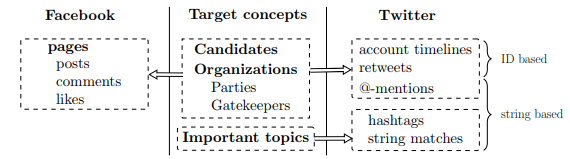

# German Federal Election 2017 Twitter Dataset Sample

This dataset contains results from the social media monitoring of Twitter for the  [German federal election campaign 2017](https://en.wikipedia.org/wiki/2017_German_federal_election). The [project](https://arxiv.org/pdf/1804.02888.pdf) collected the tweets of political candidates and organizations and the engagement of users with these contents – retweets and @-mentions on Twitter. Finally, all messages on Twitter containing at least one keyword denoting central political topics were collected. All data was publicly available at the time of data collection. The collected data is proprietary and owned by Twitter. Due to this and with respect to privacy restrictions, only a 10k tweet sample can be provided publicly here.

In addition, the DBK dataset [ZA6926](https://dbk.gesis.org/dbksearch/sdesc2.asp?no=6926) provides the following:

1. A list of all candidates that were considered in the project, their key attributes and the identification of their respective Twitter accounts (and Facebook pages). Candidate dataset: Full surname, all first names of the candidate; academic title and name pre- or suffixes (if they exist); URL of the first Facebook account; URL of the second Facebook account; URL of the Twitter account; candidate is placed on a party list; candidate’s place on the party list; candidate is a direct candidate in one of the constituencies; official number and official name of the constituency in which the candidate is running for a direct mandate; state; candidate is a member of the federal parliament (Bundestag); party of the candidate; sex, age (year of birth); place of residence; place of birth; profession. Additionally coded was: unique ID.

2. Lists of organizations relevant during an election campaign, i.e. political parties and important gatekeepers, along with their respective Twitter and Facebook accounts.

3. A list of tweet IDs which can be used to retrieve the tweets we collected during our research period.

Don't hesitate in contacting us if you should have any questions regarding the dataset sample itself or want to work with us on the full dataset. 

**Contact:** mediamonitoring@gesis.org

For an interactive exploration of the full dataset see: [mediamonitoring.gesis.org](http://mediamonitoring.gesis.org)

## Citing the Dataset
If you use the data for your own research, please consider citing the following publication: *Sebastian Stier, Arnim Bleier, Malte Bonart, Fabian Mörsheim, Mahdi Bohlouli, Margarita Nizhegorodov, Lisa Posch, Jürgen Maier, Tobias Rothmund, Steffen Staab*. **Systematically monitoring social media: The case of the German federal election 2017** ([pdf](https://arxiv.org/pdf/1804.02888.pdf), [ZA6926](https://dbk.gesis.org/dbksearch/sdesc2.asp?no=6926))
